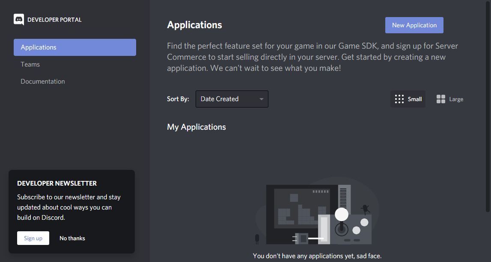
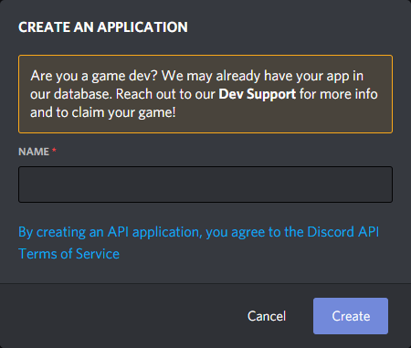
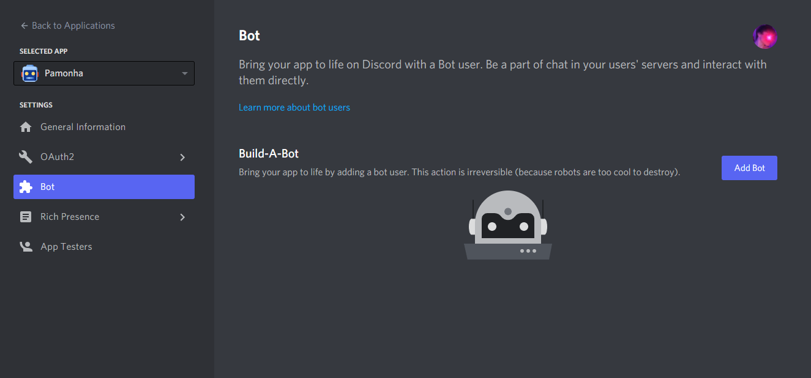
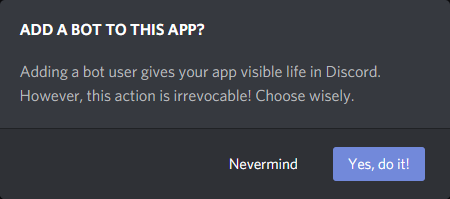
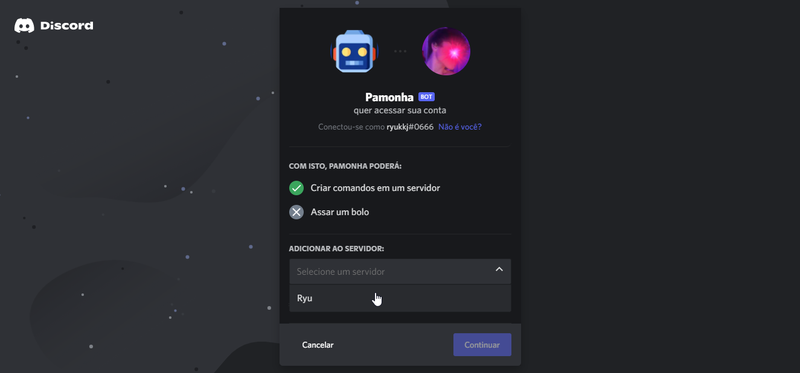
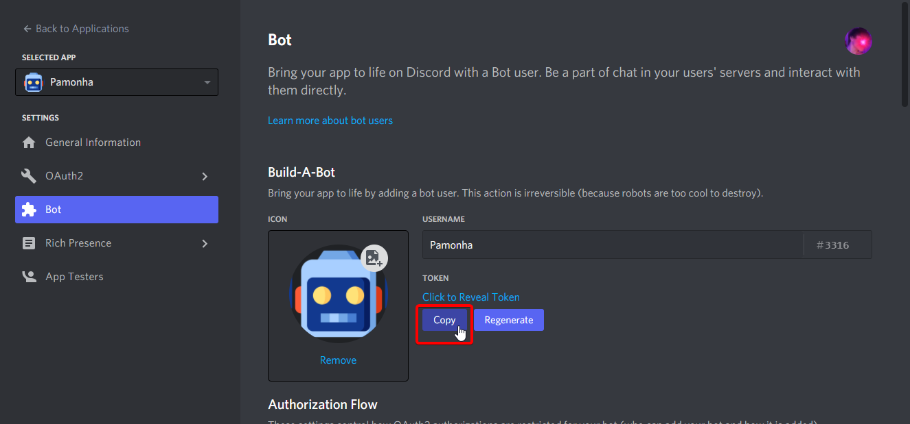

# Introdução

Então, você quer fazer um BOT e conhece bastante ou um pouco sobre JavaScript. Você quer fazer coisas legais como um BOT de música, comandos de moderação, pesquisas aleatórias de imagens, ou simplesmente tudo junto? Bem, você está no lugar certo!

Este tutorial o guiará pelas primeiras etapas da criação de um BOT, da configuração, da execução e da adição de alguns comandos a ele.

## Etapa 1: Criando seu BOT

O primeiro passo na criação de um BOT é criar seu próprio _aplicativo do Discord_. O BOT usará a API Discord, que exige a criação de uma conta para fins de autenticação. Mas não se preocupe, é super simples.

### Criando um aplicativo

Para criar um aplicativo, vá para o [Discord Developer Portal](https://discord.com/developers/applications/). Supondo que você esteja logado \(se não estiver, faça isso agora\), você chegará a uma página parecida com esta:



Clique em **New Application**. Com isso aparecerá uma janela, na qual você deve simplesmente inserir um nome para o _aplicativo_ \(este será o nome de usuário do BOT\). Clique em **Create**, para finalizar.



O **Application ID** na página será o ID de usuário do seu BOT. A descrição do aplicativo é usada na seção de bots `Sobre mim`. Portanto, sinta-se à vontade para adicionar uma descrição do seu bot em menos de 190 caracteres. (Embora a página indique claramente um máximo de 400, apenas 190 serão exibidos na seção "Sobre mim".)


### Criando uma conta do BOT

Após criar o aplicativo, precisamos criar o **Usuário do BOT**. Vá para a seção **Bot** à esquerda e você será saudado com a seguinte tela.



Por fim, clique em **Add Bot** e em **Yes, Do it!** para criar seu bot.



Há algumas coisas que você pode alterar aqui e, o mais importante, é o token.


* `Icon`: para alterar o avatar do BOT \(também pode ser feito através de código\);
* `Username`: para alterar o nome de usuário do seu BOT no Discord \(isso também pode ser feito através de código\);
* `Token`: Este é o token do seu BOT, que será usado para se conectar ao Discord;
* `Public bot`: Isso alterna a capacidade de outros usuários adicionarem seu BOT ao servidor deles. Você pode desativá-lo durante o desenvolvimento para evitar que usuários aleatórios o convidem;
* `Require Oauth2 Code Grant`: Não ative isso. Apenas, não. Não é útil para você e causará problemas se você ligá-lo;
* `Privileged Gateway Intents`: Agora, isso é importante, se o seu BOT estiver verificando dados de presença ou baixando a lista de membros, você precisará alternar um ou ambos, por enquanto eles não são necessários. Mas observe que, se o seu BOT atingir 100 servidores, você precisará estar na lista de permissões e verificado para usá-los;

### Adicione seu bot a um servidor

Ok, pode parecer um pouco cedo para fazer isso, mas isso realmente não importa - mesmo que você não tenha escrito uma única linha de código para o seu BOT, você já pode "convida-lo" para um servidor. Para adicionar um BOT, você precisa das permissões _Manage Server_ ou _Administrator_ no servidor. Esta é a **única** maneira de adicionar um BOT, não pode usar links de convite ou quaisquer outros métodos.

Para gerar o link, clique em **OAuth2** na página do aplicativo (está acima de `Bot`), depois em **URL Generator**, procure por **Scopes**. Verifique se na caixa de seleção está selecionado a opção `bot` para gerar um link, se você planeja adicionar comandos de barra, certifique-se de selecionar a opção `applications.commands` também.

Normalmente, os BOT's são convidados com as _permissões_ específicas que são dadas à função dele, que não pode ser removida, a menos que você remova e o convide novamente. Isso é opcional, mas você pode definir essas permissões na página **Bot**, rolando para baixo até a seção **Bot Permissions**. Verifique as permissões que seu BOT requer. Isso modifica o link de convite acima, que você pode compartilhar.

Depois de ter o link, você pode copiá-lo para uma janela do navegador e visitá-lo. Ao fazer isso, você verá uma janela que permite escolher o servidor onde adicioná-lo, basta selecionar o servidor e clicar em **Continuar**.



Você precisa estar logado no Discord no navegador com sua conta para ver uma lista de servidores. Você só pode adicionar um BOT a servidores nos quais você tenha permissões de **Gerenciar servidor** ou **Administrador**.

### Obtendo seu token

Tudo bem, **agora preste atenção**, **É SÉRIO**. Esta próxima parte é muito, muito importante: o **token** do seu BOT deve ser **SECRETO**. É a maneira pela qual seu BOT se autentica nos servidores Discord da mesma forma que você faz login com um nome de usuário e senha. **Revelar seu token é como colocar sua senha na internet**, e qualquer pessoa que receber esse token pode usar **sua** conexão de BOT para fazer coisas maliciosas. Como deletar todas as mensagens do seu servidor e banir todos os membros. Se o seu token chegar à Internet, **altere-o imediatamente**. Isso inclui colocá-lo em pastebin/hastebin, tê-lo em um repositório público do github, exibir uma captura de tela dele, ou qualquer coisa **ENTENDEU?**, o Github fez uma parceria com o Discord para invalidar seu token se ele for encontrado em seu repositório público e o avisará que está sendo alterado por meio de uma mensagem do `Sistema`.

Com esse aviso fora do caminho, vamos para o próximo passo. O Token, como acabei de mencionar, é a maneira pela qual o BOT se autentica. Para obtê-lo, acesse a seção **Bot** da página do aplicativo e clique em **Copiar** para copiá-lo para a área de transferência. Você também pode _clicar para visualizar_ seu token, se desejar. Sem esquecer o importante botão `Regenerate`, que gerará um novo token caso o seu esteja comprometido:



## Step 2: Preparando seu ambiente de codificação

Isso pode soar desnecessário, mas vou dizer de qualquer maneira: você não pode simplesmente começar pôr o código do BOT no terminal e esperar que funcione. Para usar o discord.js, você precisará de algumas coisas instaladas. Pelo menos:

* Obtenha o Node.js versão 16.6.0 ou superior \(versões anteriores não são suportadas\). [Baixe para Windows](https://nodejs.org/pt-br/download/) ou se você estiver em uma distribuição Linux, via [gerenciador de pacotes](https://nodejs.org/pt-br/download/package-manager/).
* Obtenha um editor de código de verdade! Não use o notepad ou notepad++, eles não são suficientes. [VS Code](https://code.visualstudio.com), [Sublime Text 3](https://www.sublimetext.com/3) e [Atom](https://atom.io/) são frequentemente recomendados.

Depois de ter o software necessário, a próxima etapa é preparar um _espaço_ para seu código. Por favor, não coloque seus arquivos na área de trabalho, é... anti-higiênico. Se você tiver mais de um disco rígido ou partição, poderá criar um local especial para seu projeto. O meu, por exemplo, é `D:\develop\` , e meu BOT é `D:\develop\pamonha\`. Depois de criar uma pasta, abra sua CLI \(Interface de Linha de Comando\) nessa pasta. Usuários de Linux, você sabe como. Usuários do Windows, aqui está um truque: `Shift + Clique com o botão direito` na pasta e em **Abrir a janela do PowerShell aqui**. Pronto!

E agora você já está pronto para o próximo passo!

## Instalando o Discord.js

Então você tem sua CLI pronta, em uma pasta vazia, e você só quer começar a codificar. Certo, espere um último segundo: vamos instalar o Discord.js. Mas primeiro vamos inicializar esta pasta com o NPM, o que garantirá que qualquer módulo instalado estará aqui e em nenhum outro lugar. Simplesmente execute `npm init -y` e pressione Enter. Um novo arquivo será criado, com o nome: `package.json`, [clique aqui](https://docs.npmjs.com/files/package.json) para mais informações sobre ele.

E agora instalamos o Discord.js através do NPM, o Node Package Manager:

`npm i discord.js`


Isso levará alguns segundos e exibirá muitas coisas na tela. A menos que você não tenha nenhuma grande mensagem vermelha dizendo que não funcionou, ou pacote não encontrado, ou qualquer outra coisa, você está pronto para ir. Se você olhar para sua pasta, notará que há uma nova pasta criada: `node_modules`. Ela contém todos os pacotes instalados para seu projeto.

## Colocando seu primeiro BOT em execução

Sinceramente, considero que, se você chegou até aqui, você compreende o mínimo de JavaScript. Se você não entender o exemplo a seguir, acesse [CodeAcademy](https://www.codecademy.com/learn/introduction-to-javascript) e aprenda JavaScript primeiro. Eu imploro: pare, e aprenda pelo menos o básico.

Ok, finalmente, estamos prontos para começar a codificar \o/. Vamos dar uma olhada no exemplo mais básico. Segue o código na íntegra:

```javascript
const { Client, Intents } = require("discord.js"); // O Client e as Intents são desestruturados do discord.js, pois exporta um objeto por padrão. Leia sobre desestruturação aqui https://developer.mozilla.org/pt-BR/docs/Web/JavaScript/Reference/Operators/Destructuring_assignment
const client = new Client({
  intents: [Intents.FLAGS.GUILDS, Intents.FLAGS.GUILD_MESSAGES]
});

client.on("ready", () => {
  console.log("Estou online!");
});

client.on("messageCreate", (message) => {
  if (message.content.startsWith("ping")) {
    message.channel.send("pong!");
  }
});

client.login("TokenSuperSecretoAqui");
```

A variável `client` aqui é usada como exemplo para representar a classe [&lt;Client&gt;](https://discord.js.org/#/docs/main/stable/class/Client). Algumas pessoas chamam de `bot`, mas tecnicamente você pode chamá-lo do que quiser. Eu recomendo ficar com `client`!

Ok, vamos... realmente fazer esse cara funcionar!

1. No seu editor de código, copie esse código e cole-o em um arquivo .js.
2. Substitua a string na função `client.login()` pelo seu token.
3. Salve o arquivo como `index.js`.
4. Na CLI \(que ainda deve estar na pasta do seu projeto\) digite o seguinte comando: `node index.js` ou simplesmente `node .`.

Se tudo correu bem \(espero que tenha acontecido\) seu BOT agora está conectado ao seu servidor, está na lista de usuários e pronto para responder a todos os seus comandos... Bem, pelo menos, _um_ comando até agora: `ping`. Em seu estado atual, o BOT responderá "pong!" para qualquer mensagem que comece com, _exatamente_, `ping`. Vou demonstrar:


Sucesso! Agora você tem um BOT em execução! Como você provavelmente já deve ter percebido, eu provavelmente poderia tagarelar muito mais, mostrando um monte de coisas. Mas o objetivo deste tutorial já está completo!

## O próximo passo?

Agora que você tem um BOT básico e funcional, é hora de começar a adicionar novos recursos! Vá até [Discord.js Guide](https://discordjs.guide) para continuar sua jornada conhecendo os recursos da biblioteca do discord.js!

## Adendo: Obtendo ajuda e suporte

Antes de começar a obter suporte dos servidores Discord para ajudá-lo com seu BOT, recomendo fortemente dar uma olhada nos seguintes recursos muito úteis.

* [Discord.js Documentation](http://discord.js.org): Pelo amor de tudo que é sagrado, **leia a documentação**. Sim, será estranho no início se você não estiver acostumado com a "documentação do desenvolvedor", mas contém muitas informações sobre cada recurso da API. Combine isso com os exemplos acima para ver a API no contexto.
* [Discord.js Guide](https://discordjs.guide): O guia do discord.js é um ótimo lugar para quem está começando a utilizar o discord.js. Há informações detalhadas sobre a criação de um BOT e sobre sua funcionalidade.
* [Discord.js Official Server](https://discord.gg/djs): O servidor oficial tem várias pessoas competentes para te ajudar, e a equipe de desenvolvimento também está lá!
